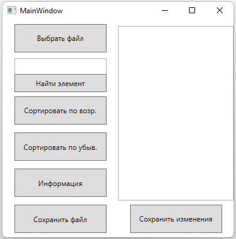

TextInfo - приложение для работы с текстовыми файлами
============================================================================
Приложение представляет собой решение для работы с текстовыми файлами. Инструментарий приложения весьма небольшой, он позволяет выполнять следующие действия:
- Открывать и сохранять текстовые файлы на компьютере при помощи диалогового окна
- Создавать текстовые файлы
- Редактировать текст
- Сортировать символы как по возрастанию, так и по убыванию
- Определять, содержится ли в тексте введенная пользователем строка или символ
- Подсчитывать количество символов и слов в тексте и выводить их на экран

Интерфейс
------
Приложение имеет графический интерфейс в виде окна и элементов управления:
- Открыть файл - выполняет чтение данных из файла для редактирования
- Найти элемент - выводит сообщение, указывающее, содержится ли введенная в текстовое поле подстрока в тексте
- Сортировка - выполняет посимвольную сортировку по возрастанию\убыванию
- Информация - подсчитывает количество слов и символов в тексте и выводит данные на экран
- Сохранить файл - открывает диалоговое окно и предлагает сохранить введенные данные в текстовом поле в файл формата .txt
- Поле для редактирования текста и кнопка для сохранения изменений
 

Информация о сборке
------
- Язык программирования: C#
- Платформа: кроссплатформенное приложение
- Фреймворк: .NET 6.0
- Архитектура: x64
